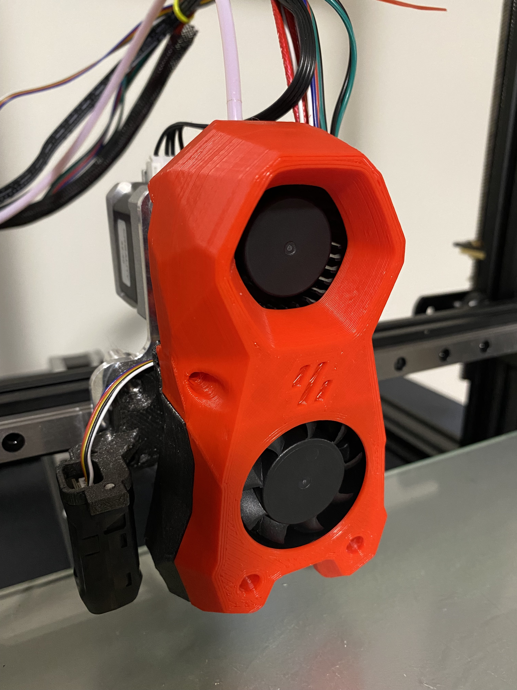
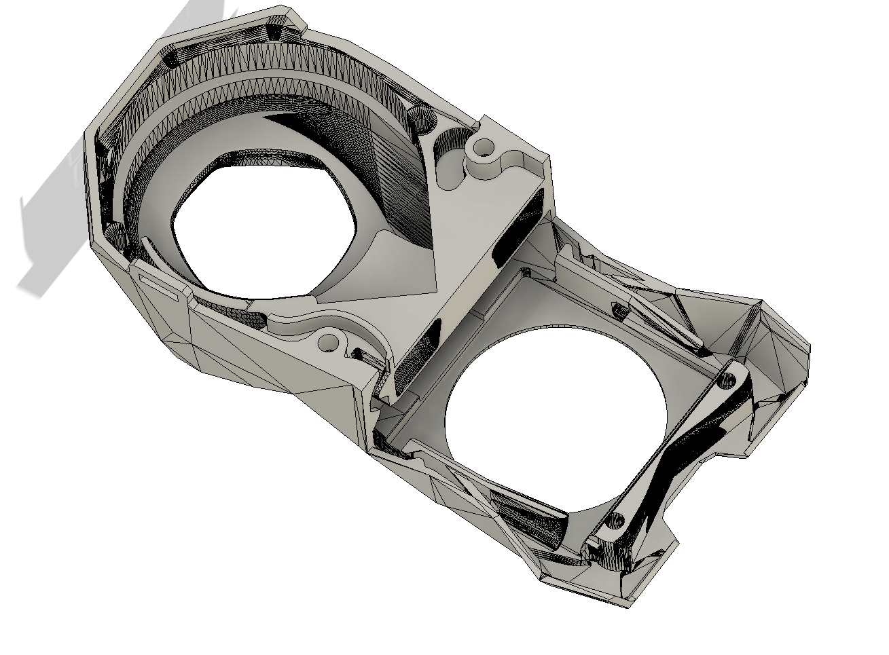
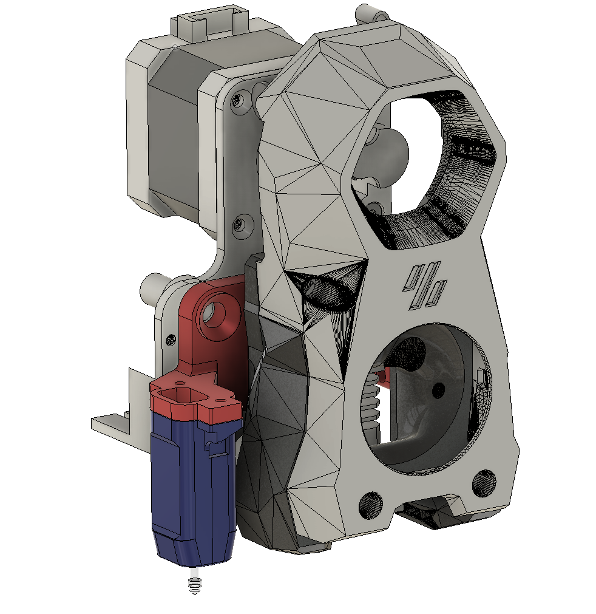
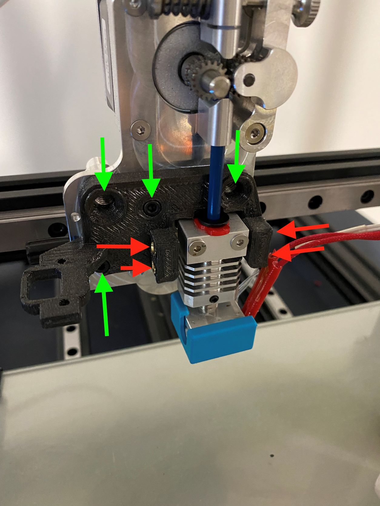

# MicroSwiss-StealthBurner
Voron StealthBurner modified to work with a MicroSwiss Direct drive extruder system.   

Thingiverse: https://www.thingiverse.com/thing:5232759
Printables: https://www.printables.com/model/157664-micro-swiss-stealthburner-beta

## Mar 19, 2022: 
- Modified Fan_Sytem_V6, I have removed the bottom sections for Neopixels
- This is basically to clean it up if you arent using them, and to provide more room to view/work.

- Added some cable managment.

- Modified Duct_System_V6, by removing the inner splitter.
- I suppose I get the original intent, but at this scale creates backpressure.  

- I have not printed these yet**
- 
## Feb 12, 2022: 
- Added vertical adjustment to Duct_System_V5.stl

- Added vertical adjustment holes to back_plate_mount_CRTouch_V5.stl.
- Will edit threaded instert depths, as there isnt much room for squishout 

## Feb 11, 2022: 
- Added Cable tie on right side (Fan_System_V5.stl)
- Added solid extrusion to remove the front logo through hole. This is used in the case you do not want to add an LED logo. (Fan_System_V5.stl)
- Added Extrusion Knob V1. Center Bore is 5.2 mm, OD is 47.0 mm, thickness is 5.0 mm
- Removed sectioned required for clockwork 2, unneeded for this mod. (Fan_System_V5.stl)

Files:
- back_plate_mount_CRTouch_V4.stl
- back_plate_mount_No_Probe_V4.stl
- Duct_System_V4.stl
- Fan_System_V5.stl

## Feb 4, 2022:
- This does not require any hardware modifications.
- This is still a beta design, as reverse engineering an STL is difficult.

Files:
- back_plate_mount_CRTouch_V4.stl
- back_plate_mount_No_Probe_V4.stl
- Duct_System_V4.stl
- Fan_System_V4.stl

Stay tuned for an additional modifications:

Extruder wheel (In Progress)
Extruder wheel side cutout of Fan System body (In Progress)
Wire management

Notes:
- The back plate and Duct System are currently attached with 4 M3*10 mm cap screws. This was to reduce a moment. After installation, it seams one screw on each side is sufficient.
- The Duct System and Back Mounting Plate are designed to use M3 threaded insert's (Red).
- There are 4 mounting locations (Green), I tapped the two wheel holes on the back mounting plate with a 1/4-20 tap. After mounting realized that's maybe a bit overkill, we'll see.

     
- After calibrating my CR-Touch, my offset was -1.94, But please don't trust this value, as yours will be different. Probe to Nozzle was around 44, and 7 mm. This is mounted with 2 M3 screws, I did not use threaded inserts for this, but simply tapped the PETG.
- The Duct system currently requires supports for the top two "ears". I can probably redesign this with a 45 degree slope.
